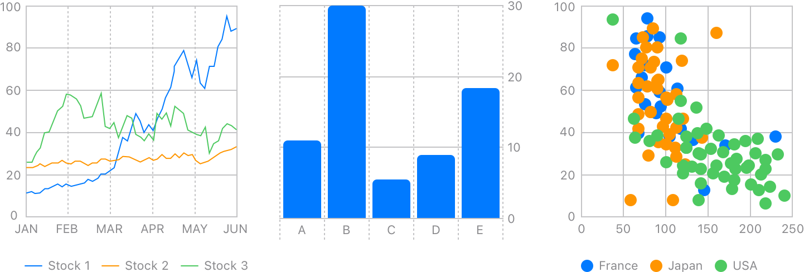

# Awesome Swift Charts

### WWDC22

- [Hello Swift Charts](https://developer.apple.com/videos/play/wwdc2022/10136/)
- [Design an effective chart](https://developer.apple.com/videos/play/wwdc2022/110340/)
- [Swift Charts: Raise the bar](https://developer.apple.com/videos/play/wwdc2022/10137/)
- [Design app experiences with charts](https://developer.apple.com/videos/play/wwdc2022/110342/)

### WWDC23

- [Explore pie charts and interactivity in Swift Charts](https://developer.apple.com/videos/play/wwdc2023/10037/)

### WWDC24

- [Swift Charts: Vectorized and function plots](https://developer.apple.com/videos/play/wwdc2024/10155/)

### WWDC25

- [Bring Swift Charts to the third dimension](https://developer.apple.com/videos/play/wwdc2025/313)

### Videos

- [Swift Charts - Beyond the basics](https://www.youtube.com/watch?v=r22o9ZupNVk)
- [How FAST is Swift Charts? Can it handle a sound visualizer? - SwiftUI - iOS 16](https://www.youtube.com/watch?v=8kX1CX-ujlA)

### Articles

- [Human Interface Guidelines](https://developer.apple.com/design/human-interface-guidelines/charts)
- [Mastering charts in SwiftUI. Pie and Donut charts.](https://swiftwithmajid.com/2023/09/26/mastering-charts-in-swiftui-pie-and-donut-charts/)
- [Mastering charts in SwiftUI. Scrolling.](https://swiftwithmajid.com/2023/07/25/mastering-charts-in-swiftui-scrolling/)
- [Mastering charts in SwiftUI. Selection.](https://swiftwithmajid.com/2023/07/18/mastering-charts-in-swiftui-selection/)
- [Mastering charts in SwiftUI. Accessibility.](https://swiftwithmajid.com/2023/02/28/mastering-charts-in-swiftui-accessibility/)
- [Mastering charts in SwiftUI. Legends.](https://swiftwithmajid.com/2023/02/22/mastering-charts-in-swiftui-legends/)
- [Mastering charts in SwiftUI. Customizations.](https://swiftwithmajid.com/2023/02/15/mastering-charts-in-swiftui-customizations/)
- [Mastering charts in SwiftUI. Interactions.](https://swiftwithmajid.com/2023/02/06/mastering-charts-in-swiftui-interactions/)
- [Mastering charts in SwiftUI. Custom Marks.](https://swiftwithmajid.com/2023/01/26/mastering-charts-in-swiftui-custom-marks/)
- [Mastering charts in SwiftUI. Mark styling.](https://swiftwithmajid.com/2023/01/18/mastering-charts-in-swiftui-mark-styling/)
- [Mastering charts in SwiftUI. Basics.](https://swiftwithmajid.com/2023/01/10/mastering-charts-in-swiftui-basics/)
- [Build and style a chart with the new Swift Charts framework](https://nilcoalescing.com/blog/BuildAndStyleAChartWithSwiftChartsFramework)
- [Ridgeline plot with Swift Charts](https://nilcoalescing.com/blog/RidgePlotWithSwiftCharts)
- [Use SwiftUI views as points in scatter plot](https://nilcoalescing.com/blog/ScatterPlotWithCustomViews)
- [Plotting data distributions with Swift Charts](https://nilcoalescing.com/blog/PlottingDataDistributionsWithSwiftCharts)
- [Using Measurements from Foundation for values in Swift Charts](https://nilcoalescing.com/blog/UsingMeasurementsFromFoundationAsValuesInSwiftCharts)
- [Fill bar marks with gradient in Swift Charts](https://nilcoalescing.com/blog/FillBarMarksWithGradient)
- [Area chart with a dimming layer up to the current point in time](https://nilcoalescing.com/blog/AreaChartWithADimmingLayer)
- [Show chart annotations on hover in Swift Charts](https://nilcoalescing.com/blog/ChartAnnotationsOnHover)

### GPTs

- [Apple Swift Charts Complete Code Expert](https://chatgpt.com/g/g-8U1iB3EIq-apple-swift-charts-complete-code-expert)

### Examples

- [Visualizing your app’s data](https://developer.apple.com/documentation/charts/visualizing_your_app_s_data)
- [Creating a data visualization dashboard with Swift Charts](https://developer.apple.com/documentation/Charts/creating-a-data-visualization-dashboard-with-swift-charts)
- [Swift Charts Examples](https://github.com/jordibruin/Swift-Charts-Examples)
- [BookstoreStategist - SwiftCharts Demo Project](https://github.com/gahntpo/BookstoreStategist)
- [Reproducing some D3 Charts with Swift Charts](https://github.com/raheelahmad/Swift-D3-Charts)

